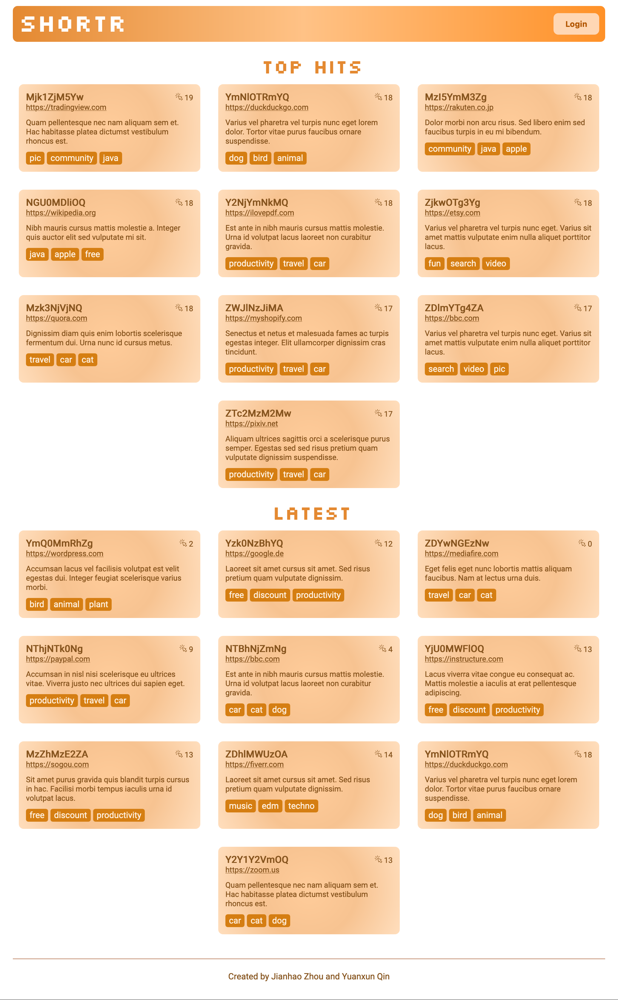
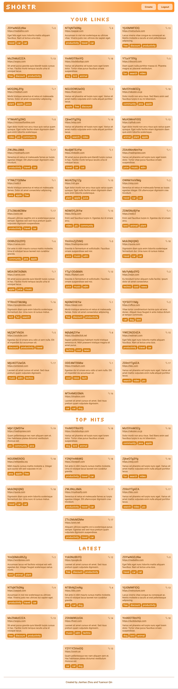
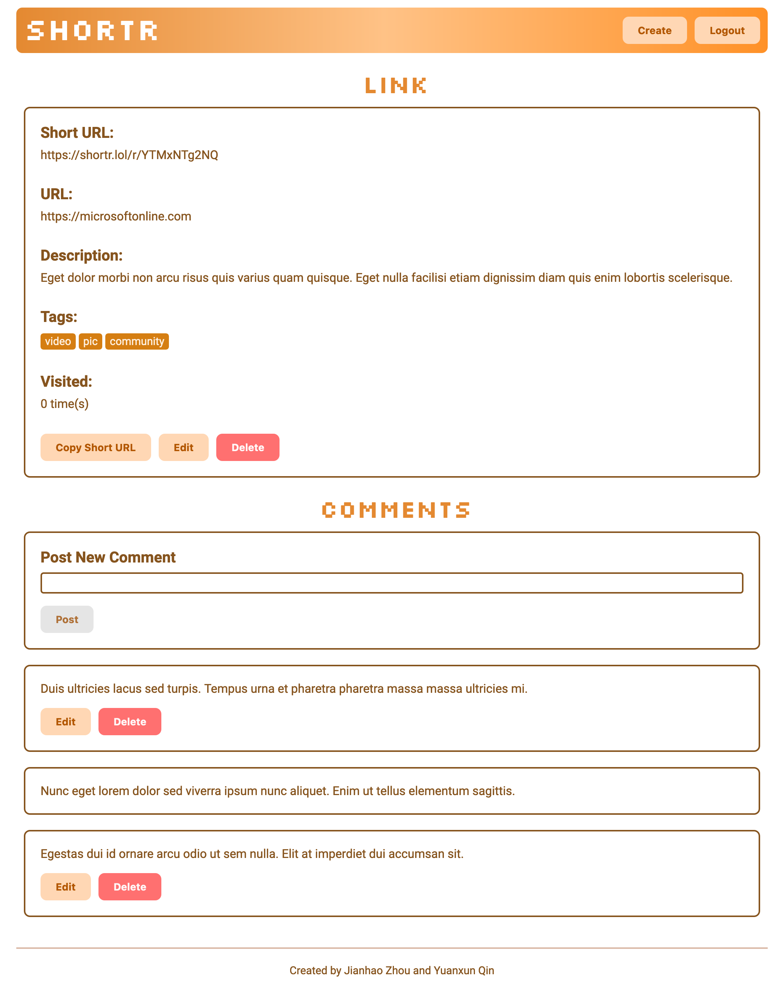
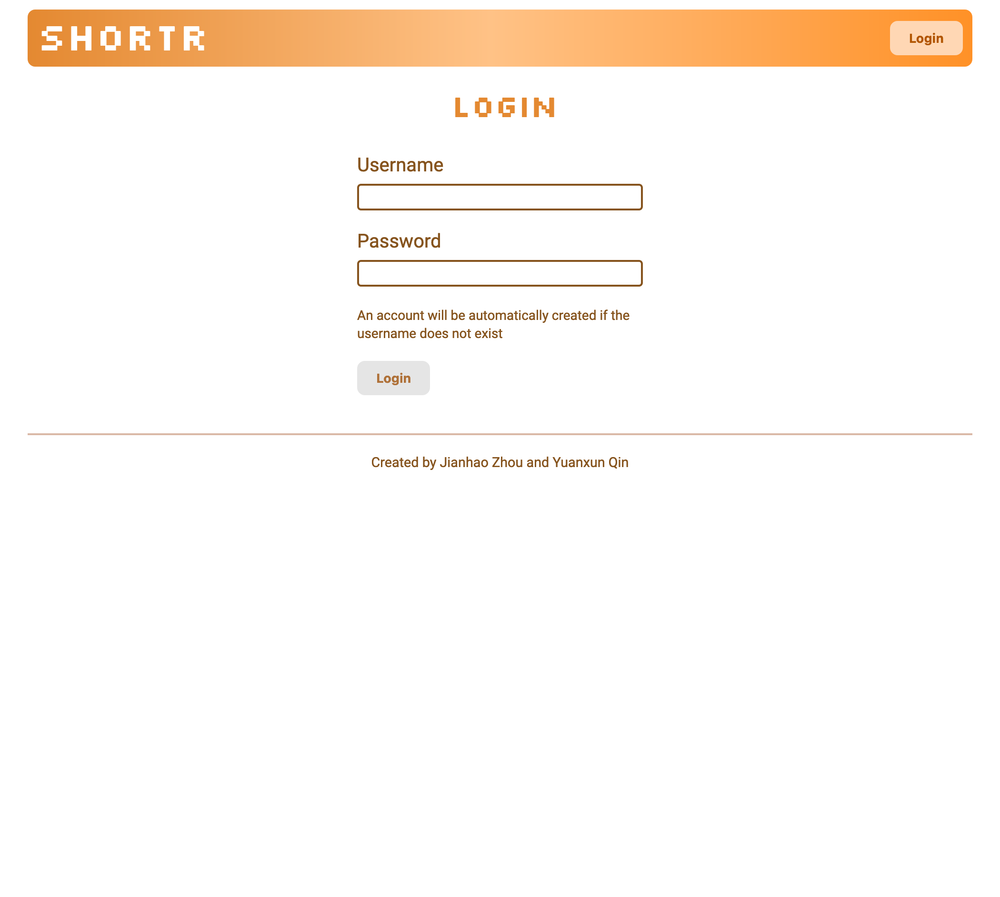
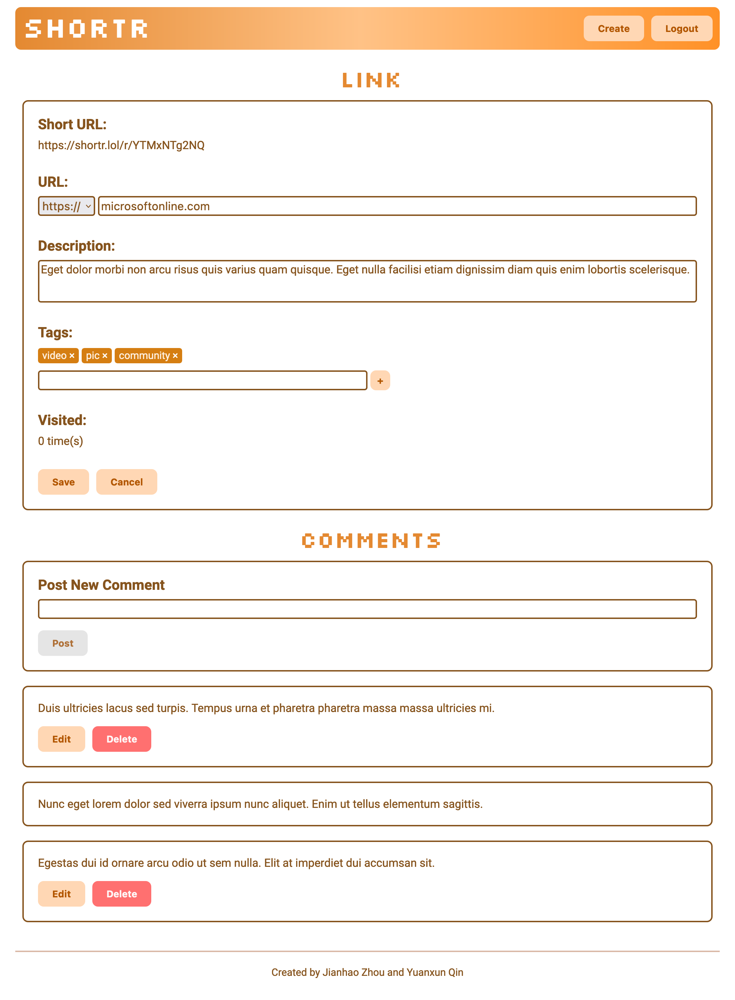
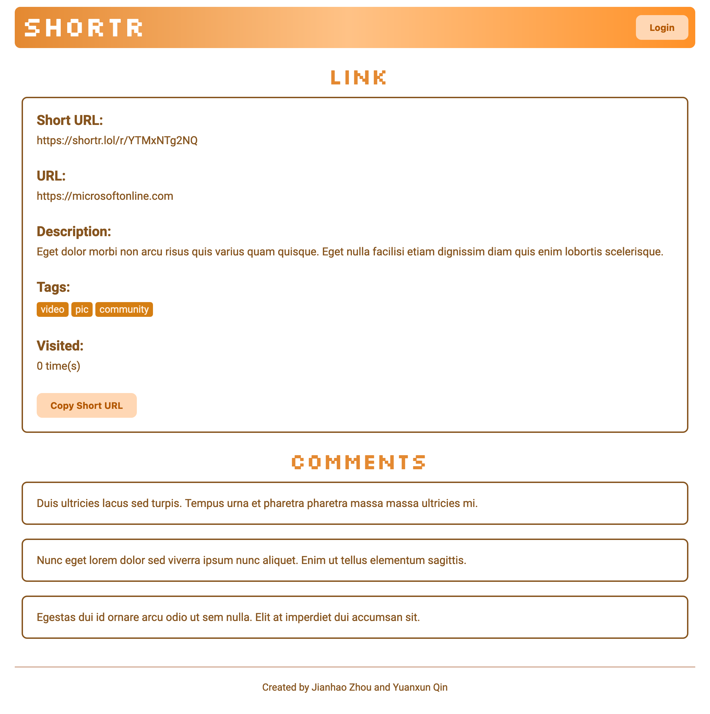

# Shortr

## Project objective

A link shortener and link sharing platform that allows users to share links and get a shortened link.

### Home

This is the landing page. It shows top short links and most popular links on the site. 

### Link

The page shows details of a link and its comments, with the ability to edit and delete.

### Login

The page is used to log in.

## Screenshots

## Tech requirements
- Linux server with Docker installed
- a modern web browser

## How to install / use

### For users

You don't need to install anything to use the project. Just visit it via [this link](https://shortr.lol).

### For developers

- Clone the project from GitHub: `git clone git@github.com:eqiowtj/shortr.git`
- Install docker and docker-compose: `apt install docker docker-compose -y`
- Deploy: `cd deploy; sh deploy.sh YOUR_MONGO_USERNAME YOUR_MONGO_PASSWORD`, the website will be available on `http://localhost`

## Class

This project is created as an assignment for the [CS 5610 Web Development](https://johnguerra.co/classes/webDevelopment_fall_2022/) class offered by Northeastern University.

## Video demonstration

A [video demonstration](https://www.youtube.com/watch?v=59q784Y6wfM) is available.

## Author

[eqiowtj](https://eqiowtj.github.io/homepage/index.html)
[timothyq](https://cs5610sv22f-p4oy.vercel.app/index.html)

## License

This project is distributed under the [MIT License](LICENSE).
